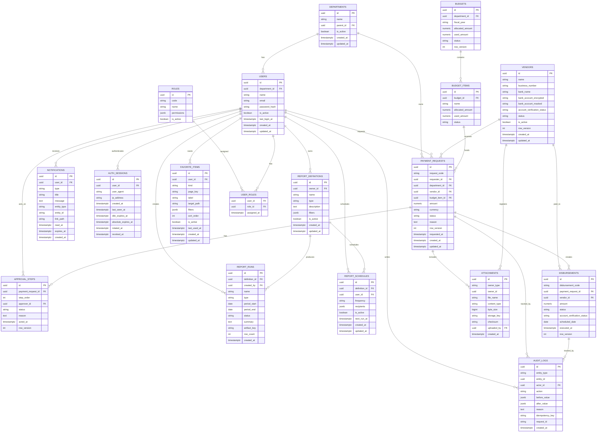

# ERP Database ERD

작성일: 2026-07-04

권장 DB: PostgreSQL

## 핵심 ERD

## 주요 인덱스

| 테이블 | 인덱스 |
| --- | --- |
| `payment_requests` | unique `(request_code)`, `(status, requested_at desc)`, `(department_id, requested_at desc)`, `(vendor_id)` |
| `approval_steps` | `(approver_id, status)`, `(payment_request_id, step_order)` |
| `disbursements` | unique `(disbursement_code)`, `(status, scheduled_date)`, `(vendor_id, scheduled_date desc)` |
| `vendors` | unique `(business_number)`, `(account_verification_status, is_active)` |
| `audit_logs` | `(entity_type, entity_id, created_at desc)`, `(actor_id, created_at desc)`, unique nullable `(idempotency_key)` |
| `notifications` | `(user_id, read_at, created_at desc)`, `(type, created_at desc)` |
| `report_definitions` | `(owner_id, type)` |
| `report_runs` | `(created_by, created_at desc)`, `(type, created_at desc)` |
| `report_schedules` | `(user_id, is_active)`, `(definition_id, is_active)` |
| `favorite_items` | unique `(user_id, kind, label)`, `(user_id, kind, sort_order)` |

## 정합성 규칙

- `row_version`은 상태 변경 시 1씩 증가한다.
- 금액은 `numeric(18, 2)`로 저장하고 표시 포맷은 프론트에서 처리한다.
- 파일 본문은 DB에 저장하지 않고 object storage에 저장한다.
- `audit_logs`는 삭제하지 않는다. 보존 기간 정책은 별도 아카이브로 처리한다.
- 계좌번호는 암호화 저장하고 목록에는 마스킹 값만 반환한다.
- 알림은 사용자별로 저장하고 기본 보관 기간이 지난 건은 목록 조회에서 제외한다.
- 보고서 파일 본문은 object storage에 두고 `artifact_key`만 DB에 저장한다.
- 즐겨찾기는 사용자별로 저장하며 비활성 메뉴는 `is_active=false`로 숨긴다.
